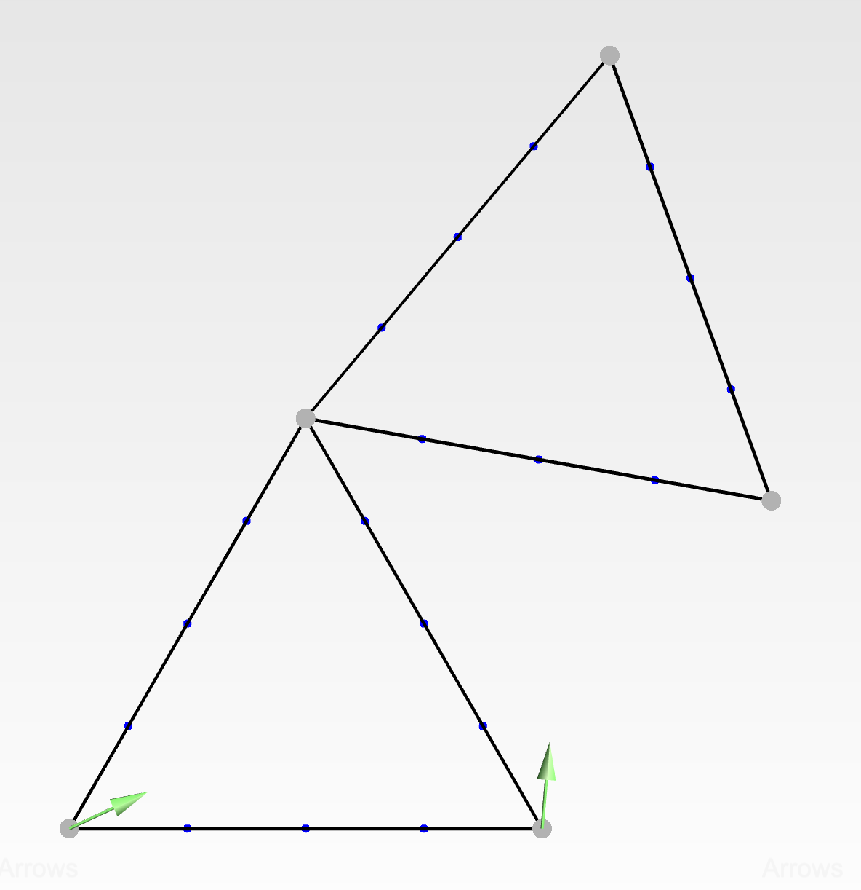
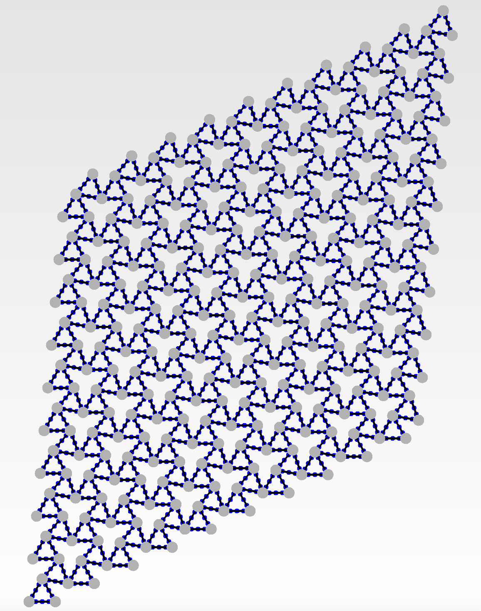
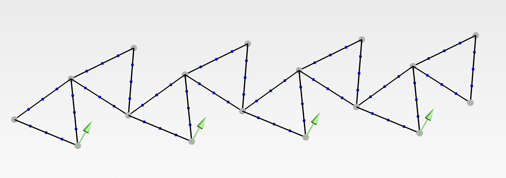

# 2D Beams Lattice Generator (2DBeamsLatticeGen)

Beams lattice generator package using **Gmsh** capabilitites.  
Supports tessellation into full 2D lattices or supercells (1D tesselation). 
You can define nodes and lattice vectors for **Bloch Analysis**.

---

## Summary:

- Define unit cells, lattice vectors and nodes for periodic boundary conditions (PBCs).
- Gmsh performs 1D beams meshing and tesselates into lattices.
- You can generate full 2D periodic lattices.
- Also supports 1D supercell strip analysis (1D periodic).
- Every beam can be defined with a flag for later material assignment.

---

## A few images

<p align="center">
  
  
</p>

<p align="center">
  
</p>

---

## Concept

The workflow is based on first defining a **single periodic unit cell** and prescribing periodic boundary conditions on its boundaries.

From this definition, the code can:

1. Find the correct nodes for a single periodic unit cell (Bulk infinite lattice analysis).
2. Tessellate the unit cell into a full 2D lattice, for full-scale simulations.
3. Generate a supercell strip (periodic in one direction only)

This allows investigation of:
- Mechanical metamaterials  
- Phononic crystals  
- Bloch wave propagation  
- Strip / waveguide geometries  
- Lattice mechanics  

---

## Example: ```main.py```

```python
import os
import subprocess
from pathlib import Path
import BeamsPackage as bp

"""2D Beams Lattice Generator Example"""

def main():
    subprocess.run('cls' if os.name == 'nt' else 'clear', shell=True)
    BASE_DIR = Path(__file__).resolve().parent
    DEFAULT_DATA_DIR = BASE_DIR / "cells.json"
    MESH_DATA_DIR = BASE_DIR / "output.mesh"

    bp.copy_example_to_cwd("cells.json")
    bp.mesher_beams1D(case="cell_kagome_lattice_test", 
                      fimport=DEFAULT_DATA_DIR, 
                      fexport=BASE_DIR, ui=True)
    bp.parse_beam_inria_mesh_file(fimport=MESH_DATA_DIR, fexport=BASE_DIR)

if __name__ == "__main__":
    main()
```

---

## Lib requirements
- Python 3.9+
- Gmsh
- NumPy
- SciPy

---

## Clone the repository:

```bash
git clone https://github.com/sergiogibe/2DBeamsLatticeGen.git
cd 2DBeamsLatticeGen
```
